# Aurora
Readme do Projeto Aurora, que foi pensado para ser um sistema que facilita o cadastro de pacientes. porém esta se desenvolvendo para um sistema muito maior. As imagens mostradas abaixo são tiradas do site que hospeda nossa versão beta antiga que upamos no pythonanywhere: "https://auroramoradadosaber.pythonanywhere.com/". O site foi e esta sendo desenvolvido por 2 devs Beckend, 1 front e 4 designers.

### 📖 Tabela de Conteúdos

-   [Descrição](#-descrição)
-   [Tecnologias Utilizadas](#-tecnologias-utilizadas)
-   [Funcionalidades](#-funcionalidades)
-   [Screenshots](#-screenshots)

---

## 📌 Descrição

O projeto Aurora foi desenvolvido como projeto da faculdade de Engenharia da Computação. Ele substitui planilhas e anotações físicas por uma solução digital integrada, promovendo agilidade, organização e segurança no atendimento.

---

## 💻 Tecnologias Utilizadas

O projeto foi construído utilizando as seguintes tecnologias:

-   **Backend**: Python + Flask
-   **Frontend**: HTML, CSS, JavaScript, Bootstrap
-   **Banco de Dados**: SQLite
-   **Hospedagem**: PythonAnywhere
-   **Outros**: Git, GitHub

---

## 🔧 Funcionalidades

-   Cadastro e gerenciamento de pacientes
-   Controle de agendamentos com notificações automáticas
-   Emissão de relatórios em PDF
-   Interface responsiva para dispositivos móveis
-   Ajustes contínuos com base em feedback real dos usuários (inicialmente desenvolvido para lares de idosos e dai pegamos os feedbacks)
-   Relatorios e dicas de cuidados para cada paciente feitos por Aurora IA 

---

## 📸 Screenshots
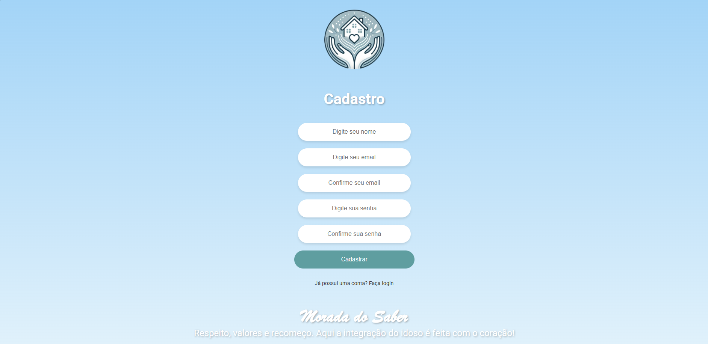
Essa é a Tela de cadastro do Aurora

---

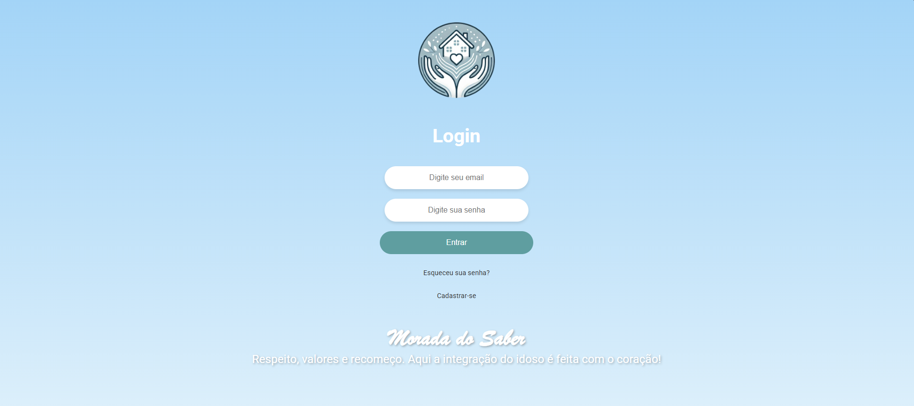
Essa é a Tela de login do Aurora

---

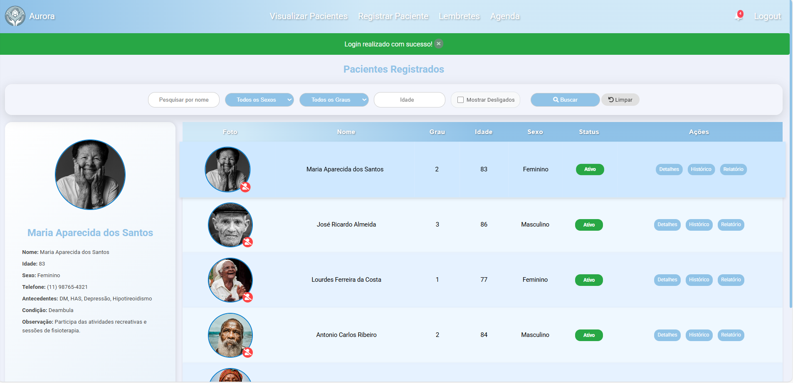
essa é a tela de visualização dos pacientes. há somente imagens de idosos por conta da ideia inicial do projeto. Você pode filtrar os pacientes por nome, Sexo, Grau, Idade e mostrar os desligados. Todos os dados deles são fictiocios pois o site esta armazenando a versão de testes. O verdadeiro foi disponibilizado para atuar na rede Local utilizando uma biblioteca de Python para transforma-lo em um Executavel.

---

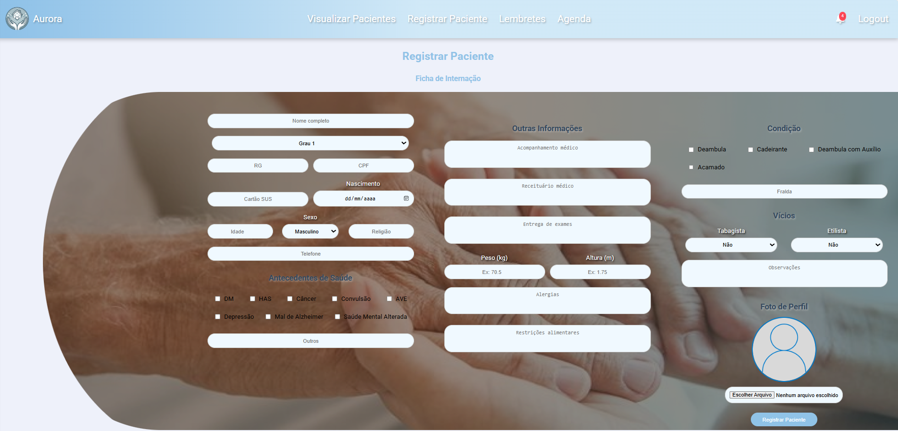
Esta é a tela de registro de pacientes, onde você passa as informações deles para o banco de dados do site.

---

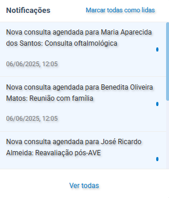
esta é uma telinha que aparece quando você clica no icone de "Sino" no canto direito da navbar para ver as notificações

---

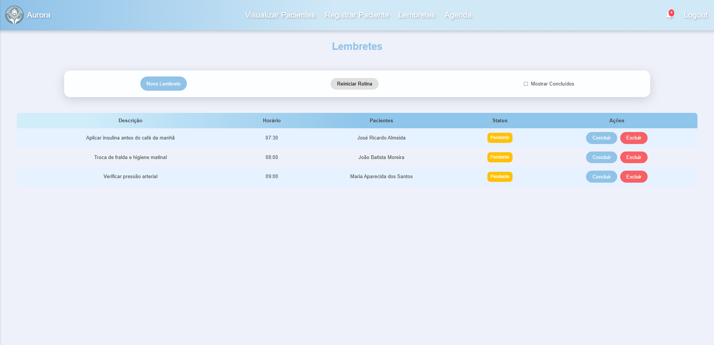
Tela de Lembretes em que você pode ver as informações de cada lembrete feito criar um novo lembrete que é a imagem a seguir, reiniciar a rotina e mostrar os concluidos.

---

Marque o horario, a descrição, o paciente e se deseja repetir ou não o aviso e então salve.

---

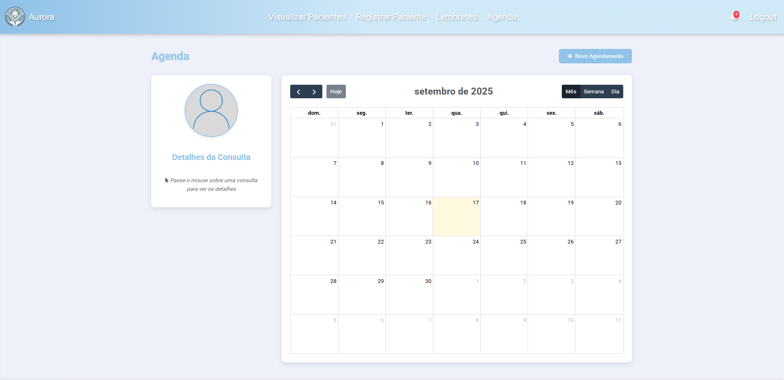
Pagina da agenda em que você pode agendar algum evento ou tarefa para um dia e horario especifico e editar ele posteriormente se nescessario.

---

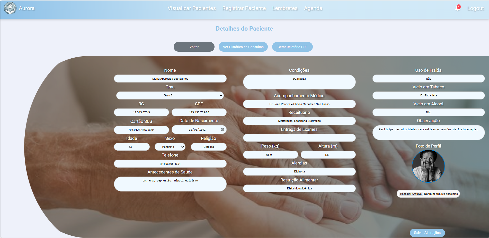
pagina de detalhamento dos pacientes em que você pode editar as informações dele.

---

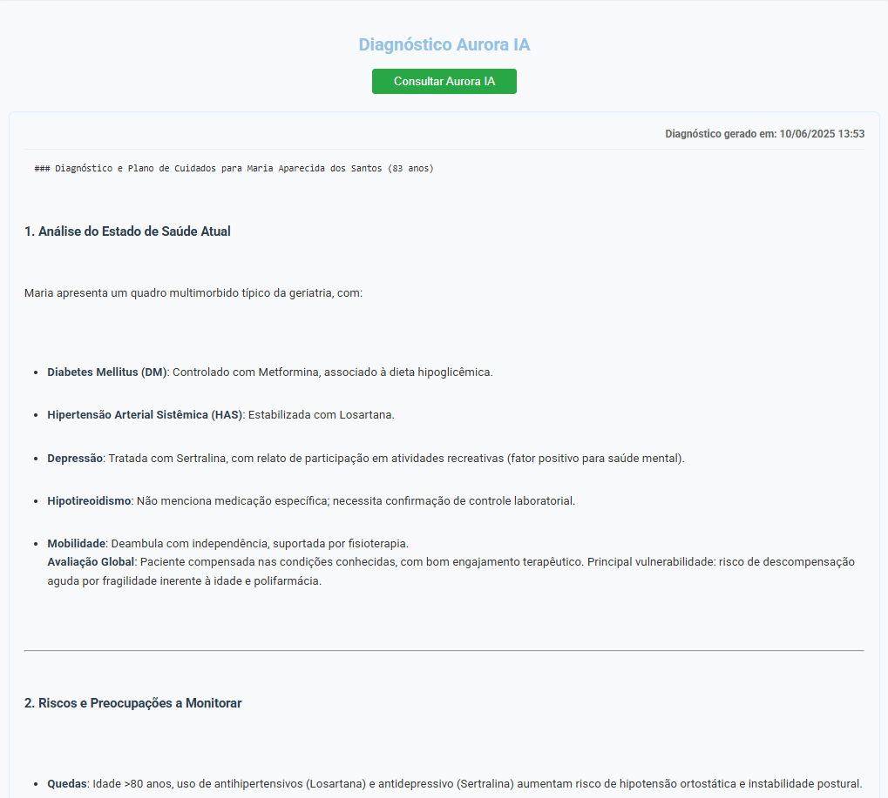
Logo abaixo da descrição dele você pode requisitar ao Aurora AI algumas dicas e informações importantes sobre o paciente.

---

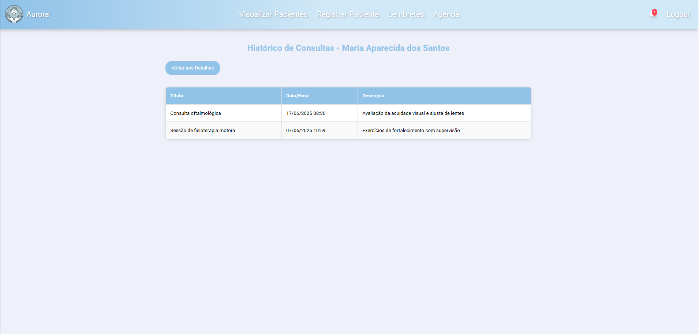
Você também pode ver o historico de consultas daquele paciente especifico no detalhes de pacientes

---

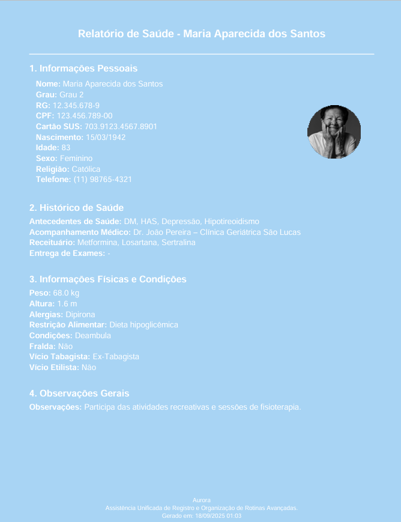
E Solicitar um PDF sobre o paciente, criado automaticamente pela aplicação.

---

# Novidades em Breve
